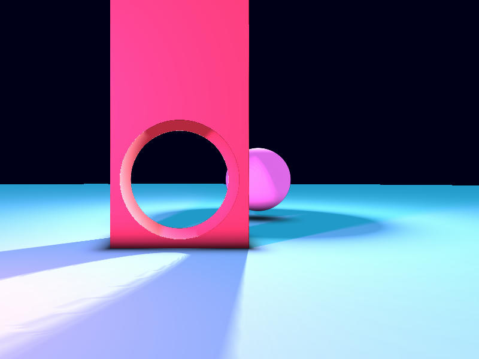

# Vulkano 🌋🦀

## What is it
- Vulkan-powered graphics system
- Uses the rust Ash library

## What it does
- Text
- Images
- Rasterization
- Shaders
- 3D geometry
- Lighting
- Screenshots (saved as ./screenshot.jpg)
- Free movement
- Camera controls

## What the shaders do
- Ray marching
- Ambient occlusion
- Anti-aliasing
- Global illumination (togglable)
- Realistic lighting

## Resources
- [Ashen Aetna](https://hoj-senna.github.io/ashen-aetna/)
- [Vulkan Pills](https://jorenjoestar.github.io/post/vulkan_bindless_texture/)
- [Blog from Michael Walczyk](https://michaelwalczyk.com/blog-ray-marching.html)
- [Rendering Worlds with Two Triangles with raytracing on the GPU in 4096 bytes](https://iquilezles.org/articles/nvscene2008/rwwtt.pdf)
- [Syntopia](http://blog.hvidtfeldts.net/index.php/2011/08/distance-estimated-3d-fractals-ii-lighting-and-coloring/)
- [Help from SciDev5](https://github.com/SciDev5)
### Screenshot without global illumination

### Screenshot with global illumination
